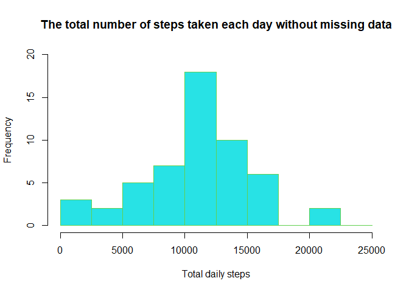
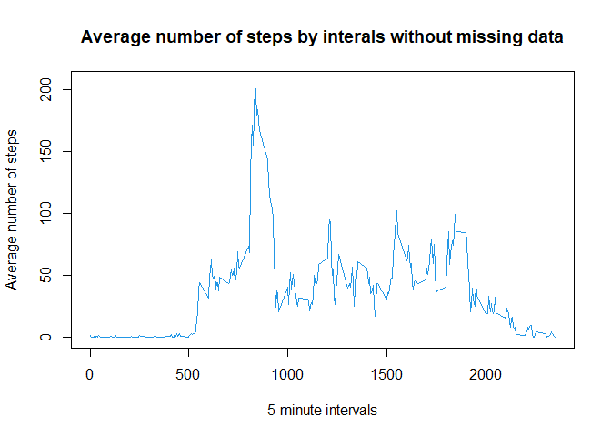
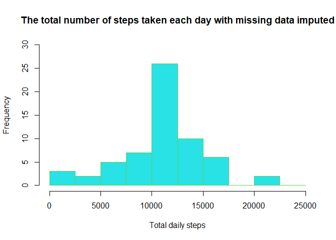
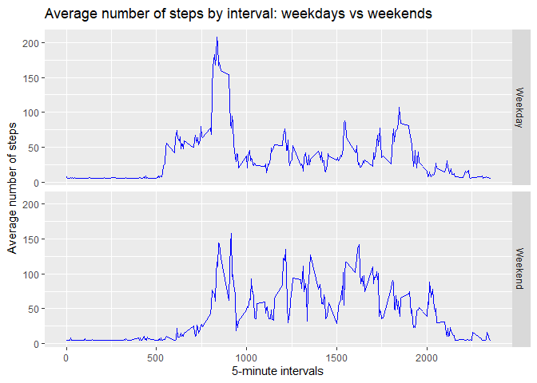

## Loading and processing the data
* step 1: download and unzip csv file into the working directory
* step 2: read csv file into data frame


```r
URL <- "https://d396qusza40orc.cloudfront.net/repdata%2Fdata%2Factivity.zip"
destFile <- "repdata_data_activity.zip"
if (!file.exists(destFile)){
        download.file(URL, destfile = destFile, mode='wb')
}
if (!file.exists("./activity.csv")){
        unzip(destFile)
}
sd <- read.csv(file = "./activity.csv")
```

## Histogram of the total number of steps taken each day
* step 1: create the summary step data by date
* step 2: show top 6 rows of summary step data
* step 3: plot historgram of the total nubmer of steps taken each day


```r
DaySteps <- aggregate(steps ~ date, sd, sum)  
head(DaySteps)
```

```
##         date steps
## 1 2012-10-02   126
## 2 2012-10-03 11352
## 3 2012-10-04 12116
## 4 2012-10-05 13294
## 5 2012-10-06 15420
## 6 2012-10-07 11015
```

```r
hist(DaySteps$steps, col=5, main="The total number of steps taken each day without missing data", 
     xlab="Total daily steps", ylim = c(0,20), border = 3, breaks = seq(0,25000, by=2500))
```

<!-- -->

## Mean and median number of steps taken each day
* step 1: calculate the mean of number of steps taken each day
* step 2: calculate the median of number of steps taken each day


```r
mean(DaySteps$steps)
```

```
## [1] 10766.19
```

```r
median(DaySteps$steps)
```

```
## [1] 10765
```

The mean of steps is **1.076619\times 10^{4}** and median is **10765** (missing data is not imputed.)


## Time series plot of the average number of steps taken
* step 1: create the average step data by interval
* step 2: show top 6 rows of average step data
* step 3: plot average number of steps taken by interval


```r
IntervalSteps <- aggregate(steps ~ interval, sd, mean)
head(IntervalSteps)
```

```
##   interval     steps
## 1        0 1.7169811
## 2        5 0.3396226
## 3       10 0.1320755
## 4       15 0.1509434
## 5       20 0.0754717
## 6       25 2.0943396
```

```r
plot(IntervalSteps$interval, IntervalSteps$steps, type='l', col=4, 
     main="Average number of steps by interals without missing data", xlab="5-minute intervals", 
     ylab="Average number of steps")
```

<!-- -->

## The 5-minute interval that, on average, contains the maximum number of steps
* step 1: find the maximum number of steps in which interval
* step 2: show maximum interval steps.


```r
MaxIntervalSteps<-subset(IntervalSteps, steps==max(IntervalSteps$steps))
MaxIntervalSteps
```

```
##     interval    steps
## 104      835 206.1698
```
It is in the **835th** interval with the maximum average steps **206.17**.


## Checking and imputing missing data
* step 1: find the total number/percentage of missing data


```r
sum(is.na(sd$steps))
```

```
## [1] 2304
```

```r
(sum(is.na(sd$steps)) / (sum(is.na(sd$steps)) + sum(!is.na(sd$steps)))) * 100
```

```
## [1] 13.11475
```

The total number of missing data is **2304** 
and the percentage of missing value is **13.11%**

* step 2: use mean to impute the missing values and create imputed data


```r
Imputed<-sd
Imputed[is.na(Imputed[,1]),1]<-mean(IntervalSteps$steps)
DayStespImputed <- aggregate(steps ~ date, Imputed, sum)  
```

* step 3: plot Histogram graph using imputed data


```r
hist(DayStespImputed$steps, col=5, main="The total number of steps taken each day with missing data imputed", 
     xlab="Total daily steps", ylim = c(0,30), border = 3, breaks = seq(0,25000, by=2500))
```

<!-- -->

* step 4: Mean and median number of steps taken each day with imputed data


```r
mean(DayStespImputed$steps)
```

```
## [1] 10766.19
```

```r
median(DayStespImputed$steps)
```

```
## [1] 10766.19
```
* step 5: Do these values differ from the estimates from the first part of the assignment? 
          What is the impact of imputing missing data on the estimates of the total daily number of steps?

        - comparing the median without vs with missing data imputed: 10765 vs 10766. 
        - comparing the historgram without vs with missing data imputed, the impact is:
          the bin frequency is different only in interval between 10000 and 12500 steps,
          the missing data imputed frequencey has been increased from 18 to 26 in this bin.

## Panel plot comparing the average number of steps taken per 5-minute interval across weekdays and weekends
* step 1: use date from imputed data to derived day type: weekday or weekend
* step 2: create average step data with day type
* step 3: show top 6 rows of average step data with day type
* step 4: use ggplot to plot the average steps by 5-minute interval and day type


```r
Imputed<-within(Imputed, dayno <-as.POSIXlt(Imputed$date)$wday)
Imputed<-within(Imputed, DayType<-ifelse(Imputed$dayno == 0 | Imputed$dayno == 6, 'Weekend','Weekday'))
IntervalStepsImputed <- aggregate(steps ~ interval+DayType, Imputed, mean)
head(IntervalStepsImputed)
```

```
##   interval DayType    steps
## 1        0 Weekday 7.006569
## 2        5 Weekday 5.384347
## 3       10 Weekday 5.139902
## 4       15 Weekday 5.162124
## 5       20 Weekday 5.073235
## 6       25 Weekday 6.295458
```

```r
library(ggplot2)
```

```
## Warning: package 'ggplot2' was built under R version 4.0.3
```

```r
ggplot(IntervalStepsImputed, aes(interval, steps, group=DayType)) +
        geom_line(color="blue") +
        facet_grid(DayType ~ .) + 
        labs(x="5-minute intervals", y=expression("Average number of steps")) + 
        labs(title=expression('Average number of steps by interval: weekdays vs weekends'))
```

<!-- -->

